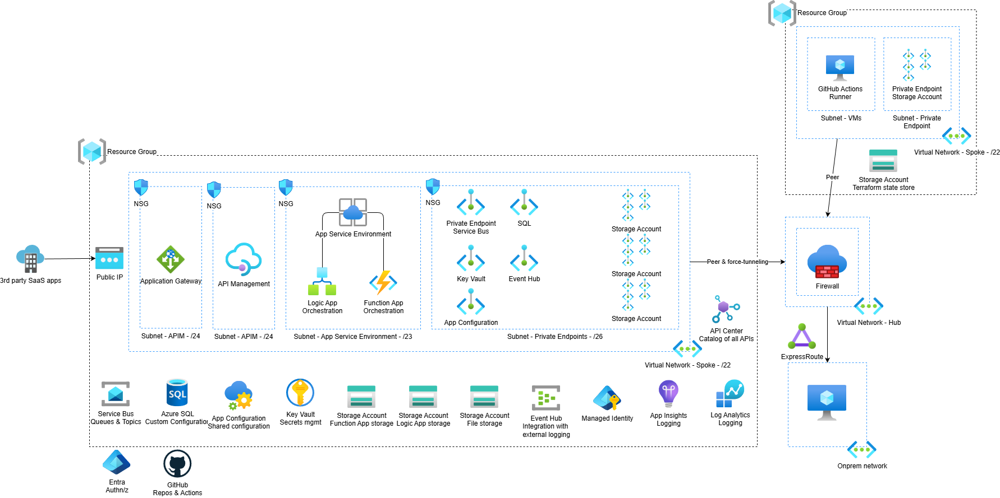

# Scenario 3: Azure Integration Services with Terraform

## Overview

This scenario uses Terraform to provision Azure resources. Infrastructure code is located in `infra/scenario3`. Deployment is automated via a GitHub Actions pipeline and can also be performed manually using the Azure Developer CLI and Terraform.

## Architecture



## Prerequisites

- Azure CLI installed
- Terraform CLI installed

## Required Environment Variables


Set the following environment variables before running deployments. These are referenced in `main.tfvars.json`:

| Variable | Description |
|----------|-------------|
| `AZURE_LOCATION` | Azure region for resource deployment (e.g., `eastus`) |
| `AZURE_ENV_NAME` | Name of the deployment environment (e.g., `dev`, `prod`) |
| `AZURE_PRINCIPAL_ID` | Azure AD principal (service principal) object ID for resource access |
| `AZURE_RESOURCE_GROUP` | Name of the resource group to deploy resources into |
| `AZURE_VIRTUAL_NETWORK_NAME` | Name of the existing virtual network |
| `AZURE_VIRTUAL_NETWORK_RESOURCE_GROUP_NAME` | Resource group containing the virtual network |
| `AZURE_PRIVATE_ENDPOINT_SUBNET_NAME` | Name of the subnet for private endpoints |
| `AZURE_APIM_SUBNET_NAME` | Name of the subnet for API Management |
| `AZURE_APP_SERVICE_ENVIRONMENT_SUBNET_NAME` | Name of the subnet for App Service Environment |
| `AZURE_APIM_PUBLISHER_NAME` | Publisher name for API Management |
| `AZURE_APIM_PUBLISHER_EMAIL` | Publisher email for API Management |
| `AZURE_WEBSITE_DNS_SERVER` | DNS server address for web apps |
| `AZURE_SQL_ADMIN_USERNAME` | Azure SQL administrator username |
| `AZURE_SQL_ADMIN_OBJECT_ID` | Azure AD object ID for SQL administrator |
| `AZURE_API_CENTER_LOCATION` | Location for API Center resources |

Additional variables for remote state backend (used in GitHub Actions):

| Variable | Description |
|----------|-------------|
| `RS_CONTAINER_NAME` | Name of the Azure Storage container for Terraform state |
| `RS_RESOURCE_GROUP` | Resource group containing the storage account |
| `RS_STORAGE_ACCOUNT` | Name of the Azure Storage account for Terraform state |
| `ARM_SUBSCRIPTION_ID` | Azure subscription ID for ARM deployments |
| `AZURE_SUBSCRIPTION_ID` | Azure subscription ID for resource deployment |

## Deployment Steps (Manual)

1. **Set environment variables** (see above).
2. **Initialize Terraform:**
	```bash
	terraform init \
	  -backend-config="storage_account_name=$RS_STORAGE_ACCOUNT" \
	  -backend-config="container_name=$RS_CONTAINER_NAME" \
	  -backend-config="key=azd/azd.tfstate" \
	  -backend-config="resource_group_name=$RS_RESOURCE_GROUP"
	```
3. **Format Terraform files:**
	```bash
	terraform fmt -check
	```
4. **Generate `terraform.tfvars.json`:**
	```bash
	chmod +x generate-tfvars.sh
	./generate-tfvars.sh
	```
5. **Plan deployment:**
	```bash
	terraform plan -input=false
	```
6. **Apply deployment:**
	```bash
	terraform apply -auto-approve -input=false
	```

## Azure Developer CLI

You may use Azure Developer CLI (`azd`) for additional automation and environment management. Refer to the project root `azure.yaml` for configuration.

1.  Run the following command to deploy the solution

    ```bash
    azd up
    ```

## GitHub Actions Pipeline

A pipeline is defined in `.github/workflows/scenario3-deploy.yaml`:

- Triggers on changes to `infra/scenario3` or the workflow file.
- Runs on self-hosted runners.
- Installs required tools (Azure CLI, Terraform, Node.js).
- Logs into Azure using credentials from GitHub secrets.
- Initializes Terraform and generates `terraform.tfvars.json` using environment variables.
- Runs `terraform plan` and (optionally) `terraform apply` on pushes to the default branch.
